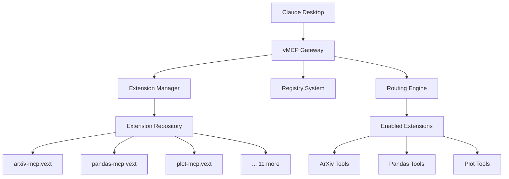

# vMCP - Virtual Model Context Protocol

[](https://github.com/JaimeCernuda/vmcp/actions/workflows/ci.yml)
[](https://codecov.io/gh/JaimeCernuda/vmcp)
[](https://www.python.org/downloads/)
[](https://opensource.org/licenses/MIT)
[](https://github.com/astral-sh/ruff)
[](https://github.com/astral-sh/uv)

> **A unified gateway for Model Context Protocol (MCP) servers, inspired by the DXT (Desktop Extensions) specification**

vMCP provides a Virtual File System-like abstraction layer that aggregates multiple MCP servers through a single interface, enabling seamless access to diverse tools and capabilities from scientific computing, data analysis, and more.

## 🔗 What is vMCP?

vMCP (Virtual Model Context Protocol) is a **gateway and proxy system** that:

- **Unifies Multiple MCP Servers**: Access 14+ scientific computing tools through a single interface
- **DXT-Inspired Architecture**: Uses extension packaging similar to VS Code or Chrome extensions
- **Extension Management**: Install, enable, disable, and manage MCP servers like browser extensions
- **Persona Support**: Control which tools are available to different users/contexts
- **stdio Transport**: Compatible with Claude Desktop and other MCP clients

Think of vMCP as a "package manager for MCP servers" with a unified gateway interface.

## 🚀 Quick Start

### Prerequisites

- Python 3.10+
- [uv](https://docs.astral.sh/uv/) package manager

### Installation

```bash
# Clone and install
git clone https://github.com/JaimeCernuda/vmcp.git
cd vmcp
uv sync --all-extras

# Initialize configuration
uv run vmcp config init

# List available extensions
uv run vmcp extension list
```

### Basic Usage

```bash
# Install and enable an extension
uv run vmcp extension install arxiv-mcp
uv run vmcp extension enable arxiv-mcp

# Start the vMCP gateway
uv run vmcp start

# Now Claude Desktop can connect to vMCP as a single MCP server
# and access all enabled extensions through the unified interface
```

## 📦 Available Extensions

vMCP comes with 14 pre-packaged scientific computing extensions:

| Extension | Category | Description |
|-----------|----------|-------------|
| **adios-mcp** | Scientific Computing | ADIOS2 dataset access for simulation data |
| **arxiv-mcp** | Research | Academic paper search and download |
| **chronolog-mcp** | Data Management | Time-series data logging and retrieval |
| **compression-mcp** | Data Processing | High-performance data compression |
| **darshan-mcp** | Performance | I/O profiling for HPC applications |
| **hdf5-mcp** | Data Management | HDF5 file operations and analysis |
| **jarvis-mcp** | Materials Science | Materials database access and analysis |
| **node-hardware-mcp** | System Monitoring | Hardware monitoring and system info |
| **pandas-mcp** | Data Analysis | Data manipulation with pandas |
| **parallel-sort-mcp** | Data Processing | High-performance parallel sorting |
| **plot-mcp** | Visualization | Data visualization and plotting |
| **slurm-mcp** | Job Scheduling | SLURM cluster job management |
| **lmod-mcp** | Environment | Environment module management |
| **parquet-mcp** | Data Management | Columnar data processing |

## 🏗️ System Architecture



### Key Components

- **Gateway Server**: stdio transport compatible with MCP clients
- **Extension Manager**: DXT-inspired extension lifecycle management  
- **Repository System**: Manages extension packages (.vext files)
- **Registry**: Tracks installed and enabled extensions
- **Routing Engine**: Routes requests to appropriate MCP servers
- **Persona System**: Access control and tool restrictions (planned)

## 📖 Tutorial & Commands

### Extension Management

#### List Extensions

```bash
# List all available extensions
uv run vmcp extension list

# List only installed extensions
uv run vmcp extension list --installed

# List only enabled extensions  
uv run vmcp extension list --enabled

# JSON format for scripting
uv run vmcp extension list --format json
```

#### Install Extensions

```bash
# Install from built-in repository
uv run vmcp extension install pandas-mcp

# Install from specific repository
uv run vmcp extension install pandas-mcp --repository builtin
```

#### Enable/Disable Extensions

```bash
# Enable an extension (makes it available to vMCP)
uv run vmcp extension enable pandas-mcp

# Enable with custom configuration
uv run vmcp extension enable pandas-mcp --config '{"debug": true}'

# Disable an extension
uv run vmcp extension disable pandas-mcp
```

#### Extension Information

```bash
# Detailed information about an extension
uv run vmcp extension info pandas-mcp

# Shows: description, tools, status, installation path, etc.
```

#### Update & Uninstall

```bash
# Update an extension
uv run vmcp extension update pandas-mcp

# Uninstall an extension
uv run vmcp extension uninstall pandas-mcp

# Force uninstall (even if enabled)
uv run vmcp extension uninstall pandas-mcp --force
```

### Gateway Operations

#### Start/Stop Gateway

```bash
# Start vMCP gateway with default config
uv run vmcp start

# Start with custom config
uv run vmcp start --config my-config.toml

# Stop the gateway
uv run vmcp stop

# Check gateway status
uv run vmcp status
```

#### System Information

```bash
# List all registered servers
uv run vmcp list

# Show detailed system information
uv run vmcp info

# Health monitoring
uv run vmcp health check

# System metrics
uv run vmcp metrics show
```

### Configuration Management

```bash
# Create default configuration
uv run vmcp config init

# Create config at specific location
uv run vmcp config init --output /path/to/config.toml

# Validate configuration file
uv run vmcp config validate config.toml
```

### Repository Management

```bash
# Search for extensions
uv run vmcp repo search pandas

# Repository statistics
uv run vmcp repo stats

# Discover available extensions
uv run vmcp repo discover
```

### Shell Completion

```bash
# Generate bash completion
uv run vmcp completion bash

# Generate zsh completion  
uv run vmcp completion zsh

# Add to your shell profile
uv run vmcp completion bash >> ~/.bashrc
```

## ⚙️ Configuration

### Basic Configuration (`vmcp_config.toml`)

```toml
version = "0.1.0"

[gateway]
registry_path = "~/.vmcp/registry"
log_level = "INFO"
cache_enabled = true
cache_ttl = 300
max_connections = 1000
request_timeout = 30

[routing]
default_strategy = "hybrid"
load_balancer = "round_robin"

[transports.stdio]
enabled = true

[transports.http]
enabled = false
port = 3000
host = "127.0.0.1"

[transports.websocket]
enabled = false
port = 3001
host = "127.0.0.1"
```

### Claude Desktop Integration

To connect Claude Desktop to vMCP, add this to your Claude Desktop MCP configuration:

```json
{
  "mcpServers": {
    "vmcp": {
      "command": "uv",
      "args": ["run", "vmcp", "start"],
      "cwd": "/path/to/vmcp"
    }
  }
}
```

## ✅ What vMCP Can Do

- ✅ **Extension Management**: Install, enable, disable MCP servers like browser extensions
- ✅ **Unified Gateway**: Single stdio interface to access multiple MCP servers
- ✅ **DXT-Inspired Architecture**: Professional extension packaging and management
- ✅ **Rich CLI**: Beautiful, colored command-line interface with tab completion
- ✅ **Repository System**: Centralized extension repository with 14 scientific tools
- ✅ **Configuration Management**: Flexible TOML-based configuration
- ✅ **Health Monitoring**: Monitor extension health and performance
- ✅ **FastMCP Compatibility**: Works with both standard MCP and FastMCP servers

## ❌ What vMCP Cannot Do Yet

- ❌ **Persona System**: User-based access control (planned)
- ❌ **Dynamic Loading**: Runtime loading/unloading of extensions (planned)
- ❌ **HTTP/WebSocket Transports**: Only stdio transport currently supported
- ❌ **Extension Development Tools**: No scaffolding for creating new extensions
- ❌ **Remote Repositories**: Only local built-in repository supported
- ❌ **Extension Dependencies**: No dependency resolution between extensions
- ❌ **Hot Reload**: Extensions require gateway restart to reload

## 🛠️ Development

### Running Tests

```bash
# Run all tests
uv run pytest

# Run with coverage
uv run pytest --cov=src/vmcp

# Run specific test categories
uv run pytest -m unit
uv run pytest -m integration
```

### Code Quality

```bash
# Format code
uv run ruff format .

# Lint code
uv run ruff check .

# Type checking
uv run mypy src/vmcp
```

### GitHub Actions

The project includes comprehensive CI/CD:

- ✅ Multi-Python version testing (3.10, 3.11, 3.12)
- ✅ Code formatting and linting
- ✅ Type checking
- ✅ Security auditing
- ✅ Package building

## 🔧 Technical Details

### Extension Package Format

vMCP uses `.vext` (vMCP Extension) files, similar to DXT's `.dxt` format:

```
extension.vext
├── manifest.json          # DXT-style manifest
├── src/
│   ├── server.py          # MCP server entry point
│   └── capabilities/      # Tool implementations
├── tests/                 # Extension tests
└── README.md             # Extension documentation
```

### Manifest Structure

```json
{
  "$schema": "https://vmcp.dev/schemas/manifest.json",
  "vmcp_version": "0.1.0",
  "name": "pandas-mcp",
  "display_name": "Pandas MCP Server",
  "version": "0.1.0",
  "description": "Data analysis with pandas",
  "author": {
    "name": "Author Name",
    "email": "author@example.com"
  },
  "tools": [
    {
      "name": "data_profiling",
      "description": "Profile datasets and generate statistics"
    }
  ],
  "server": {
    "type": "python",
    "mcp": {
      "command": "uv",
      "args": ["run", "--directory", "{EXTENSION_DIR}", "python", "src/server.py"]
    }
  }
}
```

## 🤝 Contributing

1. Fork the repository
2. Create a feature branch (`git checkout -b feature/amazing-feature`)
3. Make your changes
4. Run tests (`uv run pytest`)
5. Commit your changes (`git commit -m 'Add amazing feature'`)
6. Push to the branch (`git push origin feature/amazing-feature`)
7. Open a Pull Request

## 📄 License

This project is licensed under the MIT License - see the [LICENSE](LICENSE) file for details.

## 🙏 Acknowledgments

- **[Anthropic](https://anthropic.com)** for the Model Context Protocol specification
- **[DXT Project](https://github.com/anthropics/dxt)** for extension architecture inspiration  
- **[iowarp-mcps](https://github.com/iowarp/iowarp-mcps)** for the scientific computing MCP servers
- **[uv](https://github.com/astral-sh/uv)** for fast Python package management
- **[Rich](https://github.com/Textualize/rich)** for beautiful terminal output

## 📞 Support

- 🐛 Issues: [GitHub Issues](https://github.com/JaimeCernuda/vmcp/issues)
- 📖 Documentation: [Project Wiki](https://github.com/JaimeCernuda/vmcp/wiki)
- 💬 Discussions: [GitHub Discussions](https://github.com/JaimeCernuda/vmcp/discussions)

---

**Made with ❤️ for the MCP community**